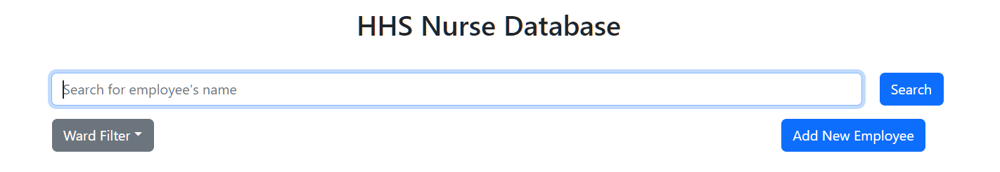
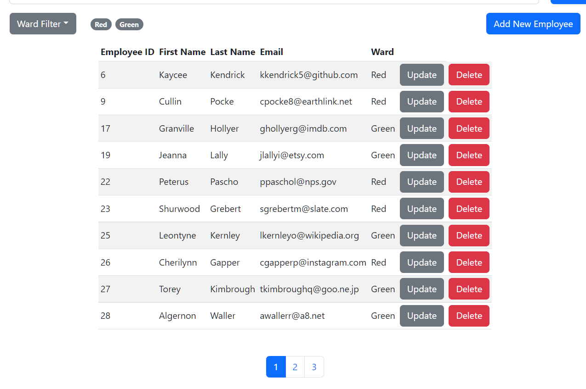
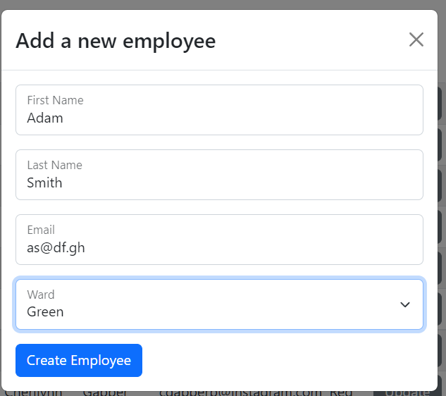

# Getting Started with HHS Nurse Management App

This project was created for an interview for the Junior Developer position at Hamilton Health Sciences

## Table of Contents

- [Getting Started with HHS Nurse Management App](#getting-started-with-hhs-nurse-management-app)
  - [Table of Contents](#table-of-contents)
  - [Installation \& Setting Up](#installation--setting-up)
    - [`yarn`](#yarn)
    - [`yarn start`](#yarn-start)
    - [`yarn build`](#yarn-build)
  - [Search for Employees](#search-for-employees)
    - [Navigate through the results](#navigate-through-the-results)
    - [Filter the Wards](#filter-the-wards)
  - [Add a New Employee](#add-a-new-employee)
  - [Update an Existing Employee](#update-an-existing-employee)
  - [Delete an Employee Record](#delete-an-employee-record)

## Installation & Setting Up

In the project directory, you can run:

### `yarn`

Install the dependencies for the app.

### `yarn start`

Runs the app in the development mode.\
Open [http://localhost:3000](http://localhost:3000) to view it in your browser.

The page will reload when you make changes.\
You may also see any lint errors in the console.

### `yarn build`

Builds the app for production to the `build` folder.\
It correctly bundles React in production mode and optimizes the build for the best performance.

The build is minified and the filenames include the hashes.\
Your app is ready to be deployed!

See the section about [deployment](https://facebook.github.io/create-react-app/docs/deployment) for more information.

## Search for Employees

You can search for one or multiple employees records by their names using the search bar at the top of the page.

Once you have enter a search term, click "Search" to get the results.

### Navigate through the results

The results are displayed in pages of maximum 10 records. You can use the pagination list under the table to navigate between different pages.

### Filter the Wards

You can click the "Ward Filter" button to open a dropdown menu where you can choose the wards you want to filter

## Add a New Employee

1. Click "Add New Employee" button
2. A form will pop up where you can fill the required information for the new employee
3. Once all the fields are filled, click "Create Employee" button under the form to add the employee to the database

## Update an Existing Employee

1. Navigate to their row in the result table
2. Click "Update" button
3. A form will pop up where you can update the employee's information
4. Once you are done, click "Update Employee" button under the form to update the data

## Delete an Employee Record

1. Navigate to their row in the result table
2. Click "Delete" button
3. A pop-up will appear asking for confirmation
4. Click "Confirm Delete" to delete the record, or close the pop-up to cancel
